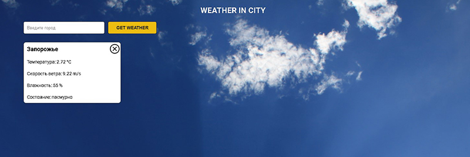
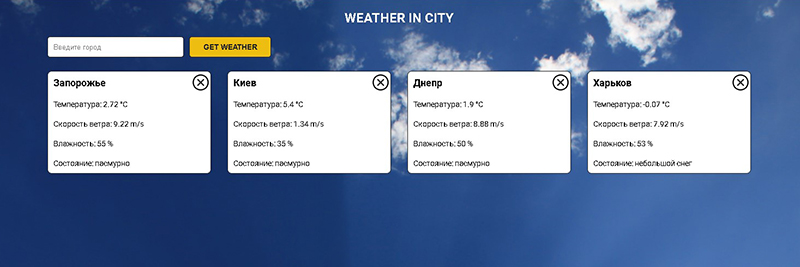

## Weather in city
Preview [Link](https://kirill8210.github.io/weather_js/)
### Task description:
Погодное приложение на JavaScript.
 
- Пользователь вводит название города в поле для
  поиска и нажимает кнопку "Get Weather".  

- Приложение отправяет запрос на OpenWeatherMap API, получает JSON данные,
  преобразовывает в JavaScript объект и выводит пользователю данные о погоде.  

- Все города сохряняются, путём сохранение в localStorage.
  При открытии приложения заново, пользователь увидит эти города и погоду для них
  автоматически, без нажатия на кнопку Get Weather.  

